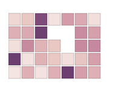
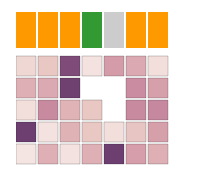
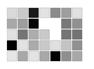

# Heatmap vis using D3

I generated a Heatmap [pseudo-]class in Javascript for the extinction paper. There were some visual elements that I included in the paper (background coloring of rows, headers, lines between groups) that were partly hackishly written and in some cases hard-coded in order to generate quickly. I've stripped most of those elements from the code, leaving the main Heatmap class from which we can build up.

## Dependencies

The viz depends on [D3](http://www.d3js.com).  

The viz generates a SVG element. There is a [really neat bookmark](http://nytimes.github.io/svg-crowbar/) that you can add to your bookmarks bar, that on clicking gives you the option of saving the graphic as a SVG. This is handy if you want to import the resulting visualization into Adobe Illustrator, for instance.

## Data Structure


### Cell data

You need to supply the Heatmap class with a vector of vectors (or list of lists) for the heatmap data. This makes the library able to consume data from JSON output easily, and additionally simple to handle outputs from python. 

Example:
```javascript
  data = [
    [0.15, 0.21, 0.90, 0.11, 0.45, 0.38, 0.12],
    [0.34, 0.38, 0.98, 0.00, 0.00, 0.53, 0.43],
    [0.12, 0.54, 0.32, 0.21, 0.00, 0.54, 0.55],
    [0.99, 0.11, 0.33, 0.21, 0.12, 0.23, 0.43],
    [0.10, 0.34, 0.11, 0.34, 0.99, 0.44, 0.34]
  ]
```

### Headers

This was something of an afterthought when generating the viz for the publication. As such, this data object is passed to the class as a separate list. If you don't pass a headers list, none is rendered.

Example:
```javascript
headers = ["Firmicutes","Firmicutes","Firmicutes","Bacteroidetes","Verrucomicrobia","Firmicutes","Firmicutes"];
```

## Sample code

__The following renders a heatmap using default visual elements to a &lt;div&gt; with id="graph":__
```javascript
graph = new Heatmap(data);
graph.renderTo('#graph');
```

Output:  


__The following renders a heatmap with headers defined, and unique sized cells:__
```javascript
graph = new Heatmap(
  data,
  { 
    width: 12 * data[0].length + 100,   // These are the dimensions of the entir visualization. Make sure
    height: 12 * data.length + 100,     // to give sufficient padding so that it doesn't get cropped.
    boxWidth: 10,                       // This is the width of each cell
    boxHeight: 10,                      // This is the height of each cell
    showHeader: headers                 // We pass the header list to render
  }
);
graph.renderTo('#graph'); 
```

Output:  


You can set your own color scale to work with your dataset by passing a colorscale function:
```javascript
graph = new Heatmap(
  data,
  { 
    colorScale: d3.scale.linear()
      .domain([0, 1])
      .range(['#FFF', '#000'])
  }
);
graph.renderTo('#graph'); 
```

Output:  



